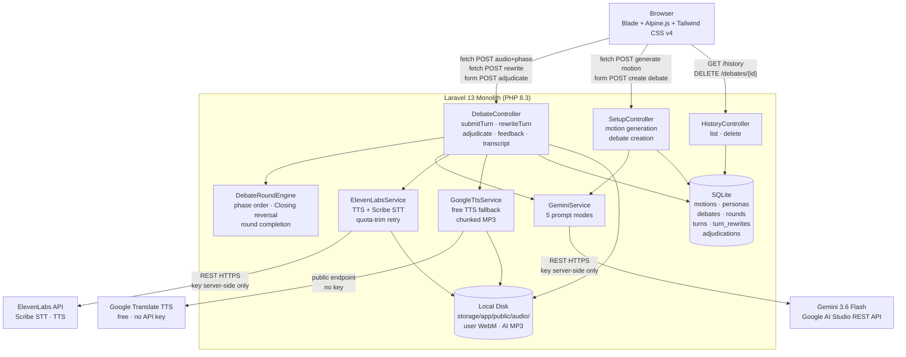
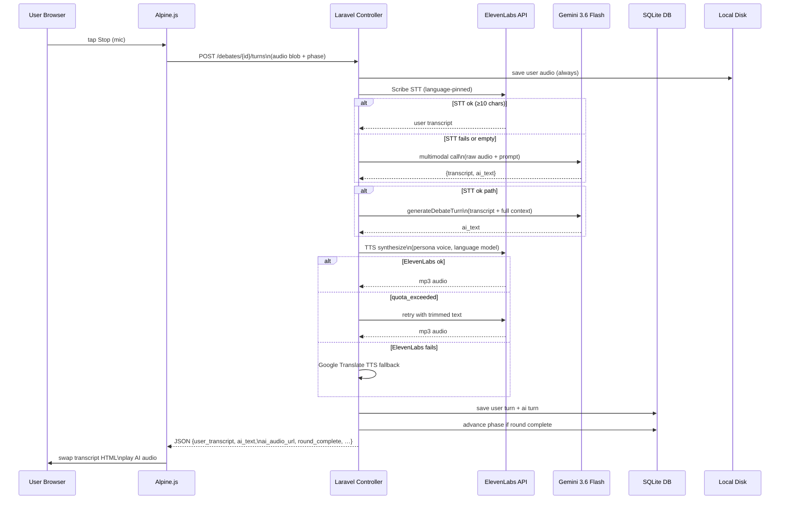
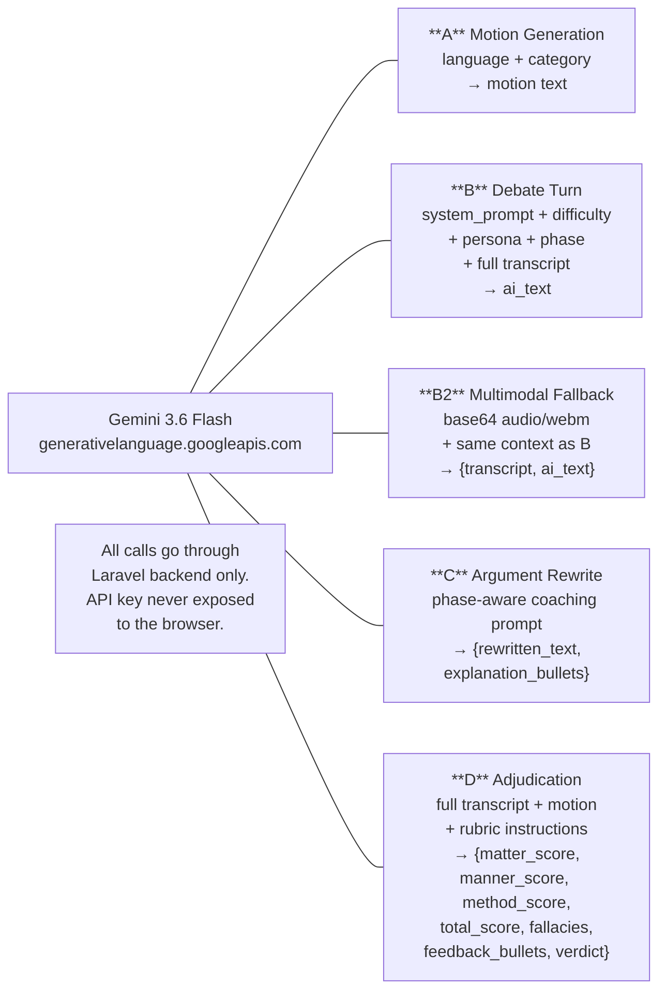
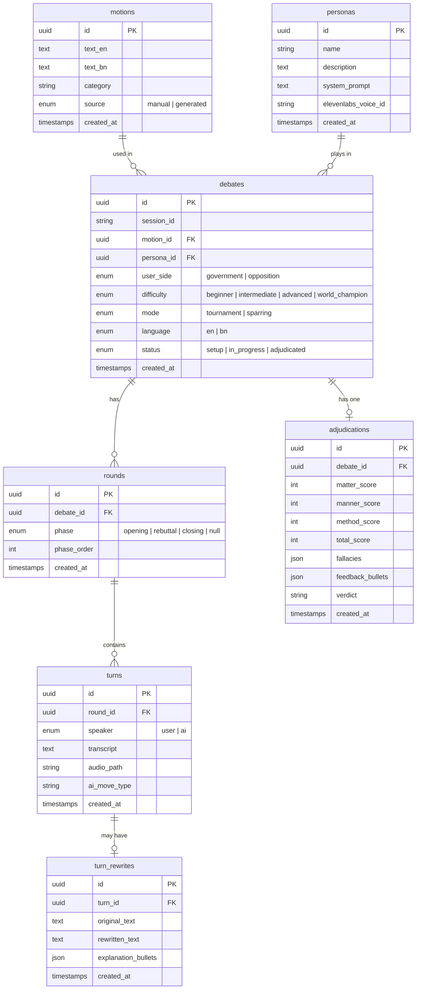
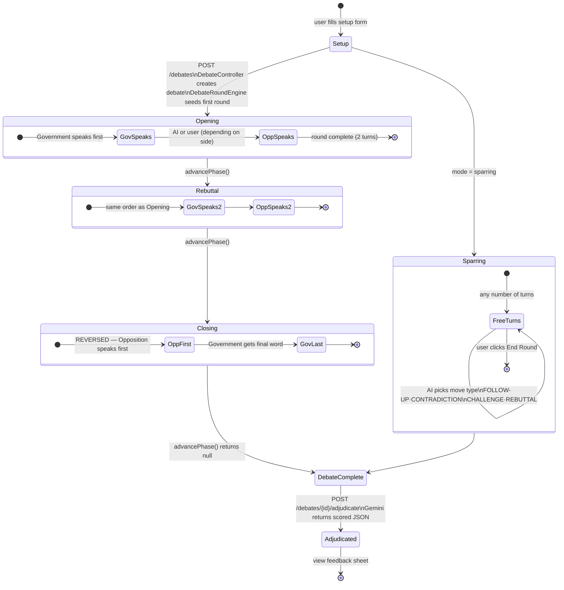

# Rostrum — AI Debate Training Platform

> **Built at [Build With AI Hack Days @EMK](https://build-with-ai-hack-days-emk.devpost.com/)**
> 
> Submitted for **Best Use of Gemini API** and **ElevenLabs Side Track (Best Use of Voice AI)**

## Table of Contents

- [What It Does](#what-it-does)
- [Problem \& Impact](#problem--impact)
  - [What Problem Does the Project Solve?](#what-problem-does-the-project-solve)
  - [Who Benefits?](#who-benefits)
  - [What is the Potential Impact?](#what-is-the-potential-impact)
- [Demo](#demo)
  - [Live Demo Link](#live-demo-link)
  - [Recorded Demo Video](#recorded-demo-video)
- [How to Use](#how-to-use)
- [Features](#features)
  - [1. Core Debate Engine](#1-core-debate-engine)
  - [2. AI Opponent — Gemini 3.6 Flash](#2-ai-opponent--gemini-36-flash)
  - [3. Voice Round-Trip — ElevenLabs](#3-voice-round-trip--elevenlabs)
  - [4. Fallback Chain (every third-party call has one)](#4-fallback-chain-every-third-party-call-has-one)
  - [5. Argument Rewrite Assistant](#5-argument-rewrite-assistant)
  - [6. AI Personas \& Difficulty](#6-ai-personas--difficulty)
  - [7. Adjudication Report](#7-adjudication-report)
  - [8. History \& Session Management](#8-history--session-management)
  - [9. Language Parity (English / Bangla)](#9-language-parity-english--bangla)
- [How We Used the APIs](#how-we-used-the-apis)
  - [Gemini API (via Google AI Studio)](#gemini-api-via-google-ai-studio)
  - [ElevenLabs API](#elevenlabs-api)
- [Architecture](#architecture)
  - [1. System Overview](#1-system-overview)
  - [2. Per-Turn Data Flow (Tournament Mode)](#2-per-turn-data-flow-tournament-mode)
  - [3. Gemini Prompt Modes](#3-gemini-prompt-modes)
  - [4. Fallback Chain](#4-fallback-chain)
  - [5. Database Schema (ER Diagram)](#5-database-schema-er-diagram)
  - [6. Debate Round State Machine](#6-debate-round-state-machine)
- [Tech Stack](#tech-stack)
- [Requirements](#requirements)
- [Local Setup](#local-setup)
- [Project Structure](#project-structure)
- [Data Model](#data-model)
- [Prize Track Declarations](#prize-track-declarations)
- [Known Limitations](#known-limitations)
- [Author](#author)

## What It Does

Rostrum is an on-demand debate sparring partner, coach, and judge — rolled into a single web app.

A user picks a debate motion (or generates one with Gemini), selects a side, an AI persona, and a difficulty level, then debates **by speaking aloud** through a structured 3-phase round (Opening → Rebuttal → Closing). The AI opponent argues back in character — using **Gemini 3.6 Flash** for reasoning and **ElevenLabs** for a distinct spoken voice and transcription. After the round, Gemini acts as a formal adjudicator and produces a scored feedback sheet modeled on real Asian Parliamentary debate rubrics.

In mid-debate, the user can tap "Improve my argument" on any of their own speeches. Gemini rewrites it live — showing a phase-aware before/after that visually demonstrates the model improving human reasoning in real time, not just answering a question.

The entire experience works in both **English and Bangla**, end to end: motions, AI arguments, spoken voice, rewrite suggestions, and adjudication feedback.

## Problem & Impact

### What Problem Does the Project Solve?
Competitive debate is a cornerstone of critical thinking, public speaking, and civic engagement across universities. However, effective debate preparation requires three distinct roles: a **sparring partner** to challenge arguments, a **coach** to refine rhetoric, and an **adjudicator** to evaluate structured speeches.

Existing learning avenues fail debaters in three critical ways:
1. **Scarcity of Judged Practice:** Club practice sessions are strictly scheduled, leaving students with limited opportunities for feedback outside weekly meetings.
2. **Language Barrier:** Almost all AI tools, practice platforms, and rubrics cater exclusively to English, leaving native **Bangla debaters** without localized sparring tools.
3. **Static Feedback:** Generic AI chatbots provide unfocused answers rather than evaluating Parliamentary debate rules (Matter, Manner, Method), detecting logical fallacies, or coaching users on phase-specific speech strategies.

### Who Benefits?
- **University & School Debaters:** Students preparing for Asian Parliamentary (AP) or World Schools Debate Championship (WSDC) circuit tournaments who need solo, on-demand practice.
- **Bangla Circuit Participants:** Native speakers looking for high-quality bilingual debate motions, speech synthesis (`eleven_multilingual_v2`), and structured feedback in Bangla.
- **Public Speaking & Logic Learners:** Anyone looking to improve critical reasoning, argument structuring, and quick-thinking skills under real-time speech pressure.

### What is the Potential Impact?
- **Democratized Debate Training:** Rostrum acts as an instant, 24/7 personalized coach for debaters regardless of geographical or financial constraints.
- **Bilingual Empowerment:** By maintaining 100% feature parity between English and Bangla (motions, STT, AI turns, speech rewrites, and adjudication), Rostrum bridges the tech gap for regional debate circuits in South Asia.
- **Actionable AI-Powered Pedagogy:** Rather than just scoring a debate at the end, Rostrum's live "Improve my argument" feature visually demonstrates how to transform weak reasoning into tournament-grade speeches in real time.

## Demo

### Live Demo Link

**Live Site:** https://rostrum.onrender.com

> **Note:** The demo is hosted on Render's free tier and may take a while to load on the first request due to cold starts.

### Recorded Demo Video


## How to Use

1. **Configure Your Debate Session (`/setup`):**
   - **Language:** Choose between English or Bangla.
   - **Motion:** Select a pre-loaded topic, enter your own motion, or click **"Generate with Gemini"** for an AI-suggested motion.
   - **Side:** Choose **Government** (Proposing) or **Opposition** (Opposing).
   - **AI Persona:** Select your AI practice partner (**Calm Logician**, **Aggressive Cross-Examiner**, or **Devil's Advocate**).
   - **Difficulty:** Pick from **Beginner**, **Intermediate**, **Advanced**, or **World Champion**.
   - **Format:** Choose **Tournament Mode** (structured 3-phase round) or **Sparring Mode** (flexible back-and-forth).

2. **Enter the Arena (`/debates/{id}`):**
   - Click the **Mic button** to begin recording your speech.
   - Speak your arguments clearly in your chosen language.
   - Click **Stop** when finished — ElevenLabs Scribe will transcribe your voice while Gemini generates the AI opponent's response.
   - Hear the AI speak back in its designated ElevenLabs voice.

3. **Improve Your Arguments Mid-Debate:**
   - Tap **"Improve my argument"** under any of your speech bubbles.
   - View Gemini's live, phase-aware rewrite along with 2-3 coaching pointers explaining what was strengthened.

4. **Review Your Adjudication Report (`/debates/{id}/feedback`):**
   - Complete all rounds (Opening, Rebuttal, Closing) and click **"Generate Adjudication Report"**.
   - Review your total score (/100) across **Matter**, **Manner**, and **Method**.
   - Inspect identified **Logical Fallacies** and actionable feedback bullets.
   - Export your report as a **PDF** or copy the full debate transcript.

## Features

### 1. Core Debate Engine
- **Tournament Mode** — 3-phase structured format: Opening (3 min) → Rebuttal (2 min) → Closing (2 min), following WSDC/Asian Parliamentary 1v1 convention. Closing reverses speaking order (Opposition first) so Government delivers the final word, matching real reply-speech rules.
- **Sparring Mode** — Informal adaptive back-and-forth. The AI picks its move dynamically: follow-up question, contradiction callout, live challenge, or standard rebuttal. It tags its move type (`[FOLLOW-UP]`, `[CHALLENGE]`, etc.) which is parsed, stored in the DB, and shown as a badge on the AI's bubble.
- **Phase-aware turn engine** — `DebateRoundEngine` enforces speaking order by phase, including the Closing reversal. First-speaker logic is computed from `user_side` + `phase`, never guessed.

### 2. AI Opponent — Gemini 3.6 Flash
- One Gemini call per AI turn, given: the full prior transcript (labeled per phase), the current phase instruction, the persona's system prompt, the difficulty modifier, and the motion + side.
- Five distinct prompt modes, all through the same model: motion generation (A), debate turn (B), Gemini multimodal audio fallback (B2), argument rewrite (C), and adjudication (D).
- **Phase-aware rewrite (C):** The rewrite prompt changes what it optimises for by phase — Opening = build the constructive case; Rebuttal = sharper surgical clash; Closing = impact comparison and persuasive framing. The rewrite is cached per turn so repeat requests are instant.
- **Structured adjudication (D):** Gemini returns strict JSON scored on Matter (/40), Manner (/30), Method (/30) + fallacy list + 3–5 grounded feedback bullets (each quoting the user's exact words from the transcript) + a verdict. A `parseJson` helper strips stray markdown fences and falls back gracefully if JSON decoding fails.
- **Retry/resilience:** Up to 5 automatic retries with exponential backoff on 429/5xx. Human-readable error messages — never a raw exception — are returned to the page if all retries fail. Round state is always preserved.

### 3. Voice Round-Trip — ElevenLabs
- **STT:** ElevenLabs Scribe (`scribe_v1`) transcribes the user's audio. Language is pinned (`eng`/`ben`) per debate — never auto-detected mid-round.
- **TTS:** Each AI persona maps to a distinct ElevenLabs voice ID:
  - Calm Logician → **Adam** (`pNInz6obpgDQGcFmaJgB`)
  - Aggressive Cross-Examiner → **Bella** (`EXAVITQu4vr4xnSDxMaL`)
  - Devil's Advocate → **Liam** (`TX3LPaxmHKxFdv7VOQHJ`)
- Model is language-aware: `eleven_multilingual_v2` for Bangla (best phonetics), `eleven_turbo_v2_5` for English — same voice ID works for both.
- **Quota-trim retry:** When ElevenLabs reports `quota_exceeded`, the remaining credit count is parsed from the error body, text is trimmed to fit the budget (with a 15% safety margin), and the request is retried once automatically — a debate never runs silent because credits ran low.
- **Voice name badge** displayed on every AI speech bubble so it's instantly visible which ElevenLabs voice is speaking.

### 4. Fallback Chain (every third-party call has one)
1. **STT:** Scribe fails / returns <10 chars → Gemini multimodal audio (transcribes + generates AI response in a single call, no extra latency) → still failing: turn saved with empty transcript, friendly note shown, AI still responds, round continues.
2. **TTS:** ElevenLabs fails (or quota exhausted after retry) → **Google Translate TTS** (free public endpoint, chunks text at ~190-char sentence boundaries and concatenates MP3 fragments) → still failing: text-only fallback with a visible notice. The AI's text is always visible regardless.
3. **Motion generation:** Gemini fails → random motion from curated English/Bangla fallback lists.
4. User audio is always saved to disk even when STT fails. Partial results (`stt_error`, `ai_error`) are always included in the JSON response — Alpine.js handles whatever succeeded.

### 5. Argument Rewrite Assistant
- Available mid-debate on any of the user's own turns — not locked to the end of a round.
- Sends transcript + motion + side + phase to Gemini → returns a full rewritten version + 2–3 short bullets explaining what changed.
- Renders as a full-width "Enhanced Version" card below the user's turn in the arena.
- Rewrite does NOT replace the user's turn in the transcript sent to the AI or scored by the adjudicator — it's a pure coaching tool.

### 6. AI Personas & Difficulty
Three personas × four difficulty levels — orthogonal axes:
- **Persona** controls *style*: Calm Logician (structured, evidence-led), Aggressive Cross-Examiner (rapid-fire challenges), Devil's Advocate (contrarian, wry).
- **Difficulty** controls *skill*: Beginner (lets weaknesses pass) → Intermediate (club-level) → Advanced (tournament-level, link-turns, impact calculus) → World Champion (identifies the single weakest link and targets it directly).
- Difficulty is implemented as a config-based prompt fragment appended at call time — no extra DB columns, no extra API calls.

### 7. Adjudication Report
- Verdict, 100-point score breakdown (Matter / Manner / Method), fallacy count badge on the cover, color-coded progress bars, per-fallacy phase tags, grounded feedback bullets with `[STRENGTH]`/`[ISSUE]`/`[TIP]` tag parsing, printable PDF via `window.print()` with `@media print` CSS, copyable transcript.

### 8. History & Session Management
- Session-scoped debate history (no login required) + a seeded demo debate that appears for every visitor so the demo is never empty.
- Filter by mode (Tournament / Sparring), search by motion text, filter by status.

### 9. Language Parity (English / Bangla)
- UI strings are in English; debate content is fully bilingual.
- Font stack loads **Inter + Noto Sans Bengali** from Google Fonts — Bangla renders correctly in every view including the printable feedback sheet.

## How We Used the APIs

### Gemini API (via Google AI Studio)
| Feature | How Gemini is used |
|---|---|
| Motion generation | Text generation with language + category prompt |
| AI opponent turn | `system_instruction` + per-turn `user` message with full transcript context |
| Sparring move selection | Same prompt, different `{phase_or_mode_instruction}` branch; model tags its move type |
| STT fallback | **Multimodal call** — raw audio (base64 `audio/webm`) inline, Gemini transcribes + responds in one call |
| Argument rewrite | Phase-aware text prompt → strict JSON output `{rewritten_text, explanation_bullets}` |
| Adjudication | Full transcript → strict JSON rubric with scores, fallacies, feedback, verdict |

All Gemini calls go through server-side Laravel controllers — API key never touches the browser.

### ElevenLabs API
| Feature | How ElevenLabs is used |
|---|---|
| STT | `scribe_v1` endpoint, language-pinned (`eng`/`ben`) |
| TTS | Persona-mapped voice ID, language-aware model (`eleven_multilingual_v2` / `eleven_turbo_v2_5`) |
| Quota-trim retry | ElevenLabs returns `quota_exceeded` with "You have N credits remaining," the request is retried once with text trimmed to fit the remaining credits — a debate never runs silent because credits ran low. |

**Per-turn flow:**
1. User speaks → Alpine.js records via `MediaRecorder`
2. Audio blob POSTed to `/debates/{debate}/turns` (same-origin, no CORS)
3. Laravel saves audio, sends to **ElevenLabs Scribe** for STT
4. If STT fails → **Gemini multimodal** (transcribes + generates AI response in one call)
5. Otherwise → Gemini text generation with full transcript context
6. TTS: **ElevenLabs** → **Google Translate TTS** → text-only silent fallback
7. Laravel persists turns, advances phase if round complete, returns JSON
8. Alpine swaps HTML into page — no full reload

## Architecture

### 1. System Overview



### 2. Per-Turn Data Flow (Tournament Mode)



### 3. Gemini Prompt Modes



### 4. Fallback Chain

```mermaid
flowchart TD
    subgraph STT["Speech-to-Text Fallback"]
        S1["ElevenLabs Scribe\nscribe_v1\nlanguage-pinned"]
        S2{transcript\n≥10 chars?}
        S3["Gemini Multimodal\ntranscribes + generates\nAI response in one call"]
        S4["Save empty turn\nshow friendly note\nAI still responds\nround continues"]

        S1 --> S2
        S2 -->|yes| DONE1["STT success"]
        S2 -->|no| S3
        S3 -->|ok| DONE2["Gemini audio fallback"]
        S3 -->|fail| S4
    end

    subgraph TTS["Text-to-Speech Fallback"]
        T1["ElevenLabs TTS\npersona voice ID\nlanguage-aware model"]
        T2{quota\nexceeded?}
        T3["Trim text to\nremaining credits\n15% safety margin\nretry once"]
        T4{ok?}
        T5["Google Translate TTS\nfree endpoint, pure PHP\nchunked at 190 chars"]
        T6["Text-only fallback\nvisible notice\nAI text always shown"]

        T1 --> T2
        T2 -->|no| DONE3["ElevenLabs audio"]
        T2 -->|yes| T3
        T3 --> T4
        T4 -->|ok| DONE3
        T4 -->|fail| T5
        T5 -->|ok| DONE4["Google TTS audio"]
        T5 -->|fail| T6
    end

    subgraph MOT["Motion Generation Fallback"]
        M1["Gemini\ntext generation"]
        M2{ok?}
        M3["Random motion from\ncurated en/bn fallback lists"]

        M1 --> M2
        M2 -->|ok| DONE5["Gemini motion"]
        M2 -->|fail| M3
    end
```



### 5. Database Schema (ER Diagram)



### 6. Debate Round State Machine



## Tech Stack

| Layer | Technology |
|---|---|
| Backend | Laravel 13, PHP 8.3+ |
| Frontend | Blade, Tailwind CSS v4 (Vite), Alpine.js (CDN) |
| Database | SQLite (portable, hackathon-ready) |
| AI | Gemini 3.6 Flash via Google AI Studio REST API |
| Voice AI | ElevenLabs Scribe v1 (STT) + TTS (3 voices) |
| TTS Fallback | Google Translate TTS (pure PHP, no key) |
| Audio | Browser `MediaRecorder` → WebM blob → server |

## Requirements

- **PHP:** `^8.3`
- **Composer:** `^2.0`
- **Node.js & npm:** `^18.0` or `^20.0`
- **Database:** SQLite (with `pdo_sqlite` extension enabled)
- **Browser:** Chromium-based browser (Google Chrome, Brave, Microsoft Edge) for HTML5 `MediaRecorder` audio capture.
- **API Keys:**
  - `GEMINI_API_KEY` (Google AI Studio)
  - `ELEVENLABS_API_KEY` (ElevenLabs)

## Local Setup

```bash
composer setup
php artisan db:seed
```

Set your API keys in `.env`:
```env
GEMINI_API_KEY=your_key_here
ELEVENLABS_API_KEY=your_key_here
```

Run the app:
```bash
composer dev
```

Open **http://localhost:8000**.

> **Browser requirement:** Chromium-based browser (Chrome, Edge) for `MediaRecorder` mic support. Safari and Firefox prompt a graceful fallback message.

## Project Structure

```
.
├── app/
│   ├── Http/
│   │   └── Controllers/
│   │       ├── DebateController.php       # Turn submission, rewrite, adjudication, feedback, transcript
│   │       ├── SetupController.php        # Motion generation, debate creation
│   │       └── HistoryController.php      # Session history, delete
│   ├── Models/
│   │   ├── Adjudication.php               # Adjudication report model
│   │   ├── Debate.php                     # Debate session model & helpers (buildTranscript, aiSide)
│   │   ├── Motion.php                     # Bilingual debate motion model
│   │   ├── Persona.php                    # AI Opponent persona model & voice mapping
│   │   ├── Round.php                      # Phase round container
│   │   ├── Turn.php                       # Speech turn record (user/AI transcript + audio)
│   │   └── TurnRewrite.php                # Argument rewrite coaching record
│   └── Services/
│       ├── DebateRoundEngine.php          # 3-phase Parliamentary engine & Closing reversal logic
│       ├── ElevenLabsService.php          # ElevenLabs Scribe STT & TTS with quota-trim retries
│       ├── GeminiService.php              # 5 Gemini prompt modes (Motion, Turn, Rewrite, Multimodal, Adjudicate)
│       └── GoogleTtsService.php           # Free chunked MP3 fallback speech synthesis
├── config/
│   └── debate.php                         # Phase durations, word counts, difficulty prompts & model settings
├── database/
│   ├── migrations/                        # SQLite schema definitions with CASCADE deletes
│   └── seeders/                           # PersonaSeeder & TournamentModeSeeder (seed demo session)
├── resources/
│   └── views/
│       ├── layouts/
│       │   └── app.blade.php              # Main shell with dark glassmorphism layout & Alpine toast
│       ├── debate.blade.php               # Live arena view (mic, timer, live rewrite, transcript)
│       ├── feedback.blade.php             # Adjudication report view (scores, fallacies, PDF export)
│       ├── history.blade.php              # Session history view with motion search & status filtering
│       ├── home.blade.php                 # Landing page with hero, features & stats
│       └── setup.blade.php                # 6-step debate session setup form
├── routes/
│   └── web.php                            # Application route definitions & health check endpoint
└── README.md
```

## Data Model

```
motions          — text_en, text_bn, category, source (manual/generated)
personas         — name, description, system_prompt, elevenlabs_voice_id
debates          — motion_id, user_side, persona_id, difficulty, mode, language, status
rounds           — debate_id, phase (opening/rebuttal/closing/null), phase_order
turns            — round_id, speaker (user/ai), transcript, audio_path, ai_move_type
turn_rewrites    — turn_id, original_text, rewritten_text, explanation_bullets (JSON)
adjudications    — debate_id, matter/manner/method/total scores, fallacies, feedback, verdict
```

All IDs are UUIDs (`HasUuids`). All child tables use `ON DELETE CASCADE`.

## Prize Track Declarations

- **Best Use of Gemini API** — 5 distinct Gemini prompt modes including multimodal audio; live argument rewrite coaching loop; structured JSON adjudication; phase-aware reasoning throughout.
- **ElevenLabs Side Track — Best Use of Voice AI** — ElevenLabs Scribe STT pins language per debate; 3 persona-mapped TTS voices (Adam, Bella, Liam); `eleven_multilingual_v2` for Bangla; quota-aware retry; voice name badge visible on every AI bubble; Google TTS as a production-grade fallback.


## Known Limitations

- **Bangla Text-to-Speech Quality:** While Bangla text generation, motion parsing, transcription, and adjudication work accurately, the synthesized Bangla voice audio using ElevenLabs (`eleven_multilingual_v2`) can sound unnaturally accented, unclear, or non-native. The underlying TTS models currently struggle with native Bengali phonetics and cadence, making spoken Bangla AI responses difficult to understand at times. Text transcripts remain fully readable and clear.

## Author
Developed by [Atia Farha](https://github.com/atia-farha).

> See `rostrum-prd.md` for the full product specification document.
